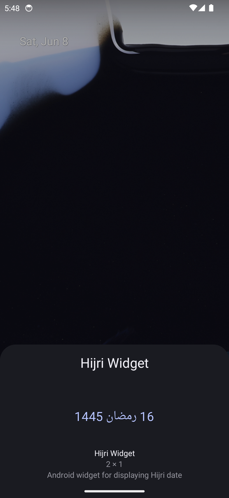
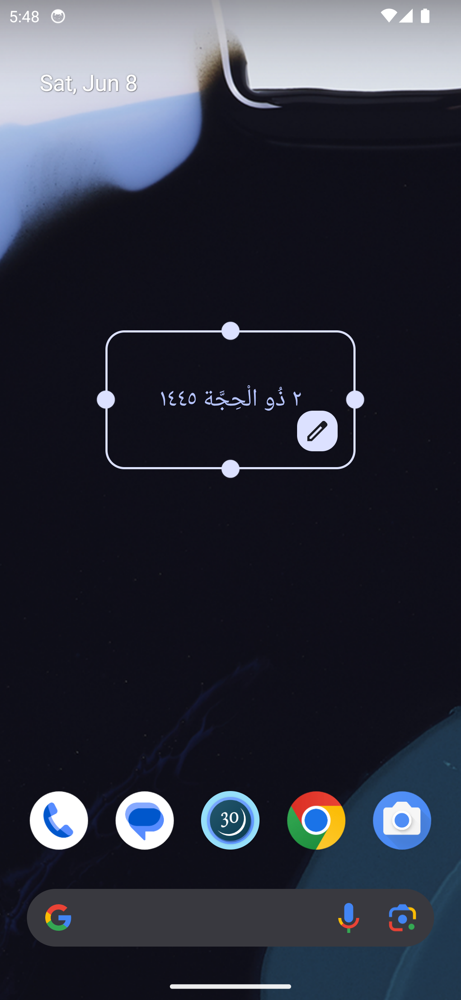

<!--suppress ALL -->
<h1 align="center">Hijri Widget</h1>

Android widget for displaying Hijri date

## Download

  <a href="https://play.google.com/store/apps/details?id=me.amrbashir.hijriwidget">
    <picture>
      
    </picture>
  </a>
  <a href="https://github.com/amrbashir/hijri-widget/releases/latest">
    <picture>
      
    </picture>
  </a>

## Screenshots

|                                                  |                                                       |                                                              |
|--------------------------------------------------|-------------------------------------------------------|--------------------------------------------------------------|
|           |               |  |
|  |  |       |
